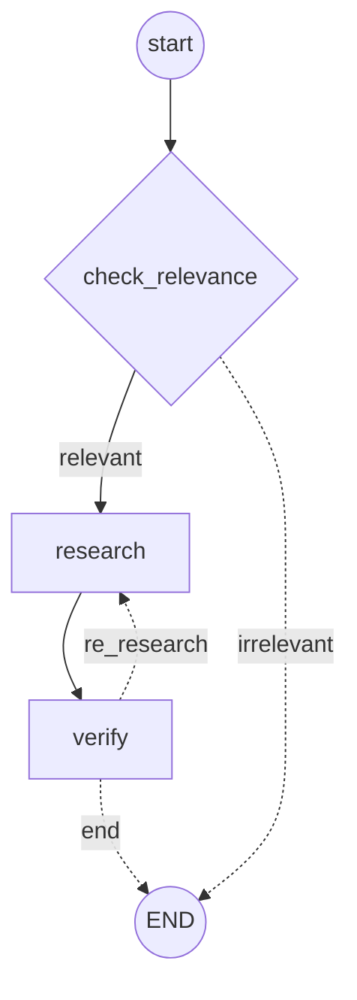

# doc-RAG 🐥

doc-RAG is a chatbot that answers questions about your own documents (PDF, DOCX, TXT, MD). You upload a document, ask a question, and a workflow of agents takes care of finding the relevant information, drafting an answer, and verifying that the answer is actually backed by the text.

## How it works

1. **Document processing**: [Docling](https://github.com/DS4SD/docling) reads the document and splits it into chunks.
2. **Retrieval**: the chunks are indexed with a hybrid retriever (vector search + BM25) using Chroma.
3. **Agents with LangGraph**: agent orchestration (check relevance → research → verify) is handled with [LangGraph](https://github.com/langchain-ai/langgraph), which decides whether to re-run the research step based on the verification result.


4. **Free IBM models**: the agents use the [IBM watsonx.ai SDK](https://pypi.org/project/ibm-watsonx-ai/) to call models like **Llama 3.3** (to draft the answer) and **Granite** (to verify it), for free through the skills-network project.
5. **Interface**: the app runs on [Gradio](https://www.gradio.app/).

## Requirements

- Python 3.12
- An IBM watsonx.ai API key

## Installation

```bash
uv sync
```

Create a `.env` file in the project root with your watsonx credentials:

```
WATSONX_API_KEY=your_api_key
WATSONX_URL=https://eu-de.ml.cloud.ibm.com
WATSONX_PROJECT_ID=your_project_id
```

## Usage

```bash
python app.py
```

This opens the Gradio interface, where you can upload one or more documents and ask your question. There are also preloaded examples to try it out quickly.

## Project structure

- `app.py` — Gradio interface and main flow.
- `agents/` — system agents (`research_agent`, `verification_agent`, `relevance_checker`) and the LangGraph workflow (`workflow.py`).
- `document_processor/` — document loading and processing with Docling.
- `retriever/` — hybrid retriever built on top of Chroma.
- `config/` — project configuration and constants.
